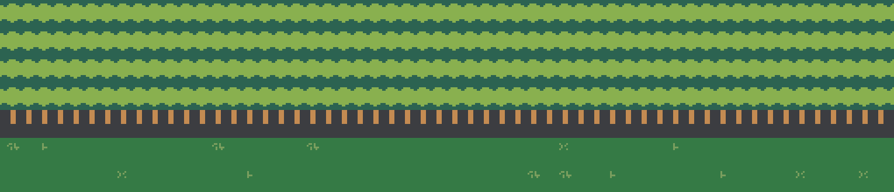
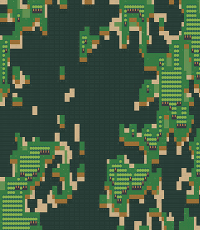

</img>
# Barnacle

Barnacle is a procedurally-generated roguelike which uses `ncurses` and `urxvt-unicode` to draw graphics in native Unicode characters on your terminal emulator!

## What the heck?
</img>
Barnacle is a game for you and your text terminal. There are a number of high quality terminal emulators today that support rich features like Unicode glyphs and 256-color display, meaning the command line has never looked better. In fact, it can look unreasonably good, considering the age of terminal technology. The goal here is to challenge the limits of unreasonability, of course!

## Installation

## How to play
